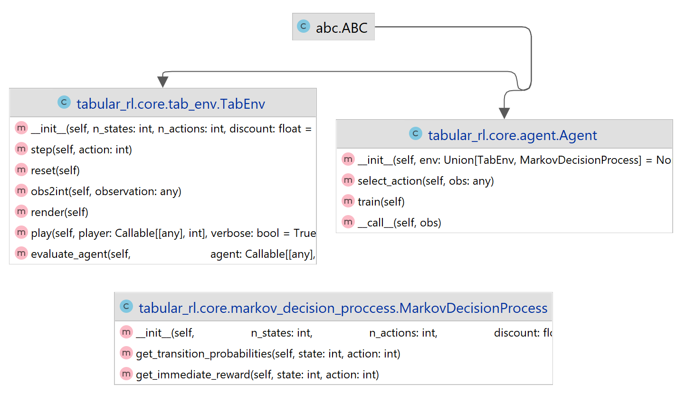

# tabular_rl
This repository aims to contain implementations of the main tabular methods in Reinforcement Learning. The goal is 
to provide a framework that allows to easily compare different methods and to easily implement new ones.

## Overview
The current methods implemented are:
- [x] Generalized Policy Iteration (Dynamic Programming)
- [x] Double Q-Learning

There are three core classes:
- `TabEnv`: This is the tabular environment in which the agent will interact. It uses the OpenAI Gym interface. For an 
environment to be considered tabular, it must have a finite number of states and actions. Actions and states are 
represented as integers from 0 to `n_actions ` - 1 and `n_states` - 1 respectively. However, we use the concept of 
"observation" which makes reference to a more meaningful state representation. For example, in the `CarRental` 
environment, the observation is a tuple of the number of cars in each location.
- `Agent`: This is the agent that will interact with the environment. Every agent is a `Callable` and returns an action 
for a given observation. An `Agent` has a `train` method that allows them to learn from the environment. If you want
to implement a rule-based agent, you can simply implement a function that returns an action given an observation.
- `MarkovDecisionProcess`: This object is used as a representation of an environment. It contains the transition
probabilities, the immediate rewards and the discount factor. It is used by agents that require a model of the 
environment such as a Dynamic Programming based agent.

Those classes are defined in the `tabular_rl.core` module. The implementations of some specific environments and
agents are in the `tabular_rl.envs` and `tabular_rl.agents` modules respectively.



## Usage

### Model-Free Agents

```python
from tabular_rl.envs import CarRentalEnv
from tabular_rl.agents import DoubleQLearning

car_rental_env = CarRentalEnv(max_episode_length=100)

agent = DoubleQLearning(car_rental_env)
agent.train(n_episodes=100_000, eval_interval=1000, n_eval_episodes=10)

print(car_rental_env.evaluate_agent(agent, n_episodes=1000))
```

### Model-Based Agents
```python
from tabular_rl.envs import CarRentalMDP, CarRentalEnv
from tabular_rl.agents import DynamicProgramming

car_rental_env = CarRentalEnv(max_episode_length=100)
car_rental_mdp = CarRentalMDP(car_rental_env)

agent = DynamicProgramming(car_rental_mdp)
agent.train(tol=0.001, max_policy_evaluations=1, max_iters=1000)

print(car_rental_env.evaluate_agent(agent, n_episodes=1000))
```
## How to Create a New Environment
There are some environments already implemented in the `tabular_rl.envs` module. However, if you want 
to create a new one, you can do it by inheriting from the `tabular_rl.core.TabEnv` class and implementing
the following methods:
- `reset`: Resets the environment and returns the initial observation.
- `step`: Performs the given action and returns the next observation, the reward, a boolean indicating if the 
episode has finished and a dictionary with additional information.
- `obs2int`: This method map each observation to an integer. This is needed since the agents assume that this is the
state representation. This allows us to use the same agent implementation for different environments.
- `render`: Renders the environment. This method is optional, but it is useful for debugging and visualize the
environment.

By inheriting from `tabular_rl.core.TabEnv`, you will also have access to the following methods:
- `evaluate_agent`: Returns the average reward obtained by the agent in the given number of episodes.
- `play`: Plays the environment using the given agent. If `verbose` is `True`, it will make use of the `render` 
method to visualize the environment while playing.
